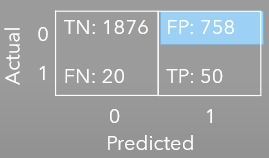
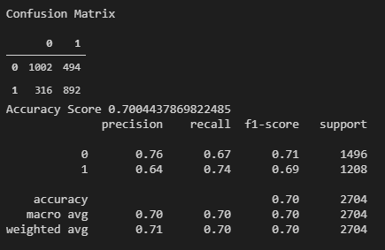
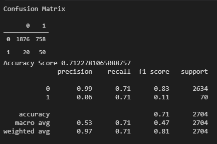
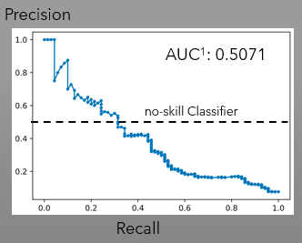
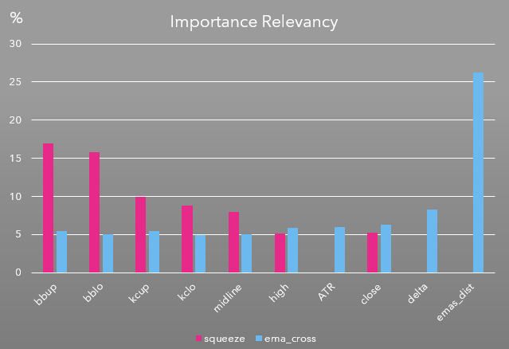

# **Algo-Owls**
A group project via the Rice University FinTech Bootcamp to demonstrate FinTech Financial Programming.

## Table of contents
* [General Information](#general-information)
* [The Underlying Strategy](#the-underlying-strategy)
* [Summary](#summary)
* [Screenshots](#screenshots)
* [Technologies](#technologies)
* [Installation Guide](#installation-guide)
* [Code Examples](#code-examples)
* [Sources](#sources)
* [Status](#status)
* [Contributors](#contributors)

---

## General Information

Securities trading can be complex for individuals and businesses.  Emotions can run wild and lead to dread, fear, hope, greed and envy, in no specific order.  Trying to control these emotions is a challenge, so this group decide to create the following repository to help us determine a strategy to produce go long signals and targets, test our theories and begin to automate our processes while incorporating some fintech we have learned in our bootcamp.  You will find the repository has the initial workings of an algorithmic trading bot that uses supervised machine learning models incorporating Tensorflow, Keras and Scikit-Learn libraries to analyze Bollinger Bands and Keltner Channels, for a squeeze breakout signal, in conjunction with slow and fast Exponential Moving Averages (EMA), for a directional signal, to make predicted decisions.  In addition to the previous models, an LSTM model to estimate price is also used to predict an entry point for a go long position.

---
## The Underlying Strategy

### **The Squeeze and the Bulge:**

The strategy is based on detecting two stages of the market: the squeeze and the bulge. The squeeze is the market sideways movement, kind of like a pause on the "trend" in which the market moves up and/or down for a period of time without making any new high or low, while the bulge is the stage in which the market is trending, creating higher highs or lower lows depending if the market is trending up or down. 

Typically the market cycles between these two stages, in which it appears calm (when market has no new high or low) for a period of time and later moves (up or down) with clear or obvious direction. So, it can be infered that periods of squeeze precede bulges. 

Is during these periods of apparent calm (sideways activity) or of a "squeeze" that we intent to get in.

To objectively define the squeeze, we combined two indicators: the bollinger bands (https://www.bollingerbands.com/) and a modified Keltner Channel. Both indicators use 20 period length, 2 Standard deviations for the Bollinger Bands, and 2 ATR (Average true range) for the modified Keltner Channel.   

The modified Keltner Channel: We modified the legacy Keltner Channel [3] formula by only taking the close and applying the 20 period ATR [5] to the 20 period simple moving average.

### **Direction of the Move**

Once the state of the market is identified, the direction for which the market is going to move needs to be anticipated, for that the crossover of 2 Exponential Moving Averages is used (the 9 period is the Fast Average while the 21 is the slow average). The identification of a squeeze and a Bulge **only** tell us that a breakout is about to occur. 

When the fastEMA crosses above the slowEMA, it is considered a bull (we go Long) and when the fastEMA crossed below the slowEMA we go short.

For simplification purposes we only focused on pedicting Bullish opportunities. 


## Machine Learning "Squeeze" Predictions & Metrics:

We designed a Random Forest Classifier, to predict the state of the market (Bulge or Squeeze) 15 mins (1 bar) ahead of occuring. The Machine Learning Model was designed with 11 features, 60% of the most relevant features utilizes 5 features: Bollinger Band upper band, Bollinger Band lower band, Keltnner Upband, Keltner LowBand and the 20 simple moving average. 
The metrics we considered important are Precision, since False Negatives are highly undesirable, and High Specificity, since high specificity means reduction of False Positives.

The Squeeze Random Forest Precision is 64%, however the specificity turns out of 67% (refer to the Classification Report- table 1).

Since specificity needs to be increased (above 80%), this model needs more analysis and perhaps adding more features to increase specificity thus reducing False Positives.

<p style="text-align: center;"> <font size="4"> Table 1 </font></p>
<table>
  <tr>
    <td><font size="2">Squeeze Model Metrics</font></td>
     <td><font size="2">EMA cross Model Metrics</font></td>
     
  </tr>
  <tr>
    <td></td>
    <td></td>
    
  </tr>
  <tr>
    <td></td>
    <td></td>
    
  </tr>
  
</table>

In regards to the Precision-Recall curve the Squeeze random Forest Model surpassed the minimum threhold of 0.5 (no-skill classifier) with an Area Under the Curve (AUC) of 0.70. Refer to table 2 for Precision-Recall Charts.

## Machine Learning "EMAs Crossover" Predictions & Metrics:

We designed a Random Forest Classifier, to predict one period (15 minutes) ahead the crossover of 2 Exponential Moving Averages (Fast and Slow EMAs). The fast EMA is based on a 9 period while the Slow EMA based on a 21 period. Since, we only are looking for to predict Bullish opportunities (to go Long), we only trained the model to look for the Fast EMA to cross above the Slow EMA.


<p style="text-align: center;"> <font size="4"> Table 2 </font></p>
<table>
  <tr>
    <td><font size="2">Squeeze Model Precision Recall Curve</font></td>
     <td><font size="2">EMA cross Model Precision Recall Curve</font></td>
     
  </tr>
  <tr>
    <td></td>
    <td></td>
    
  </tr>
  </table>

Precision on this model turned up low (6%), suspected caused by the undersampling process that this model went thru to balance the dataset from 44:1 Ratio to 1:1 Ratio. The original training dataset was scarced on occurences (1), and the majority of the dataset (6356 datapoints) were biased toward the zero. To balance the traning dataset the only possible balancing procedure applicable to this type of data (time series) was undersampling; which may have skewed the two most important features for this classifier (the EMA distance and the delta). Refer to features importance chart below for the score.



Further analysis of the Precision-Recall Curve confirmed the poor performance (Table 2) with an Area Under The Curve (AUC) not exceeding the 0.5 threhold of a no-skill classifier.

Due to the poor performance of this EMA crossover model, it is concluded that further analysis (possibly reconfiguring) needs to be done, to improve Precision and AUC of the Precision-Recall Curve.

## Summary

* The LSTM binary model caused barriers to the Machine Learning
* The two random forest classifiers offered 70% or above accuracy score
* The EMA crossover model needs reconfiguring to increase precision and to improve the precision-recall curve
* The squeeze random forest model was able to anticipate the "squeeze" state with a precision of 64%
* Tests were limited to one asset and one direction (bullish trades), so additional testing with other assets are needed.

---

## Screenshots

* LSTM Price (Actual vs Predicted)


---

## Technologies

* Python 3.7.7
* See [requirements.txt](./Resources/requirements.txt) for a list of libraries to create an environment.

---

## Installation Guide

1. Download the entire repository
2. Open Git Terminal
3. Navigate into the repository file path where you stored the files during the download.
4. The notebook files should be visible to run.
5. Make sure to create a separate virtual environment for the libraries (algo_owls_env).
6. Use [requirements.txt](requirements.txt) in the repository to install the libraries using the following commands:

    - conda deactivate
    - conda create -n algo_owls_env python=3.7.7
    - conda activate algo_owls_env
    - pip install -r requirements.txt
    - If the previous command has errors try:
        - conda install -r requirements.txt

---

## Code Examples

* Squeeze random forest target column code (Easy Language code):

```
    {!p2_squeeze_id: this indicator is to generate
numbers 1 or 0 when bollinger band are inside the keltner
}
inputs:  
	Price( Close ) [DisplayName = "Price", ToolTip = 
	 "Enter an EasyLanguage expression."], 
	Length( 20 ) [DisplayName = "Length", ToolTip = 
	 "Enter the number of bars to be used in the calculation of the average true range."], 
	NumATRs( 2 ), NumDevsUp ( 2 ), NumDevsDn (-2 );
	
variables:  
	Avg( 0 ), 
	Shift( 0 ), 
	kclo( 0 ), 
	kcup( 0 ),
	SDev (0),
	bbup (0),
	bblo (0),
	squeeze (0) ;

//Keltner Channel code

Avg = AverageFC( Price, Length ) ;
Shift = NumATRs * AvgTrueRange( Length ) ;
kcup = Avg + Shift ;
kclo = Avg - Shift ;

// Bollinger Bands code

SDev = StandardDev( Price, Length, 1 ) ;
bbup = Avg + NumDevsUp * SDev ;
bblo = Avg + NumDevsDn * SDev ;

// Comparison code

If bbup <= kcup and bblo >= kclo then 
	squeeze = 1

Else squeeze = 0; 

// Plotting squeeze code:

Plot1( squeeze, !( "squeeze" ) ) ;
```

* EMA random forest code (Easy Language code):

  

* LSTM price code

```python
    #LSTM code goes here

```

* Combined Squeeze and EMA target generator code for automation

```python
def target_generator(dataframe_name, col_name1, col_name2, target_col_name):
    """Creates a target for long position
    Args:
        dataframe_name (dict): Dataframe containing indicator data (0's and 1's)
        col_name1 (str): Name of first column name in dataframe to use for calculation
        col_name2 (str): Name of second column name in dataframe to use for calculation
        target_col_name (str): Name of target column name to create and store target values
    Returns:
        A dataframe of:
            original data passed to function,
            appended target column signals of type float (2.0, 1.0, 0.0)
    """
    
    # Target generation
    for index, row in dataframe_name.iterrows():
        dataframe_name.loc[index, target_col_name] = row[col_name1] + row[col_name2]

    # Return dataframe with features and target
    return dataframe_name
```

---

## Sources

- [1] https://rice.bootcampcontent.com/Rice-Coding-Bootcamp/rice-hou-fin-pt-09-2020-u-c/blob/master/class/15-Algorithmic-Trading/3/Activities/01-Ins_Trading_Signal_Features/Solved/trading_signal_features.ipynb

- [2] https://rice.bootcampcontent.com/Rice-Coding-Bootcamp/rice-hou-fin-pt-09-2020-u-c/blob/master/class/15-Algorithmic-Trading/1/Activities/01-Evr_Simple_Trading_Algorithm/Solved/simple_trading_algorithm.ipynb

- [3] https://en.wikipedia.org/wiki/Keltner_channel

- [4] https://en.wikipedia.org/wiki/Bollinger_Bands

- [5] https://en.wikipedia.org/wiki/Average_true_range

---

## Status

Project is: _In Progress_

---

## Contributors

* Carolina Benzaquen
* Christian Campbell
* Mark Murdock
* Jonathan Owens
